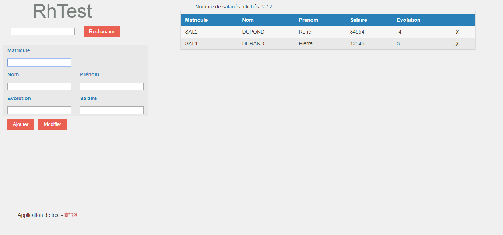

# rhtest

Les TP concernant le test nécessitent l'application mise sous test appelée RhTest disponible dans les documents ci dessous. Pour faciliter les travaux en séance, l'application est disponible via Gitpod.

## TPs

Token de l'application : monTokenSecret123

Pour les TPs 2 et 3, contact : marques-f@mgdis.fr, projet à rendre par mail pour le 30/05

Pour illustrer les phases théoriques vues en cours, les manipulations se font au travers de travaux pratiques. Ces TPs sont organisés autour de 4 thèmes et dimensionnés au regard du volume d'heures disponibles sur le module. Le temps en séance permet de manipuler les outils mais nécessite un travail personnel de synthèse et de rédaction du dossier de test.

1. [Construire son référentiel d'exigence](cours/TP-ReferentielExigence/Readme.md)
2. [Initiation au TDD](cours/TP-TDD-Test-Driven-Development/README.md)
3. [Construire son test d'Api](cours/TP-TestAPIAutomatise/Readme.md)
4. [Construire son premier test fonctionnel automatisé](cours/TP-TestFonctionnelAutomatise/Readme.md)
5. [Superviser son application avec une stack de monitoring](cours/TP-MonitoringStack/README.md)
