# TP: Tests des APi

L’objectif du TP est de découvrir le test des Api Rest.

Une API permet d’exposer à des clients des méthodes et des objets de manière simple, mais le client
d’une API doit être assuré de la stabilité des signatures et du comportement pour une version
mineure donnée.

Il est donc intéressant de vérifier qu’une API reste stable et respecte son contrat d’interface dans le
temps. Pour cela il faut créer des tests fonctionnels et automatiser leur lancement pour qu’ils soient
exécutés lors de l’intégration continue.

Postman, en se basant sur les contrats, permet de créer rapidement de nouveaux cas
de tests, avant même que le travail de développement soit commencé (Contract First, Test Driven
Development).

Les assertions, points de contrôle, qui vérifient qu'un contrat est respecté s'attacheront à comparer
les codes de retours des appels, en commençant principalement par les cas nominaux (le cas
standard représentant 80% des appels effectués).

La variabilisation des données (Data Driven Testing) ainsi que le changement d'endpoint (cible)
permettent de rejouer facilement une suite de tests sur plusieurs environnements.

## Pré requis

1.  Disposer du référentiel d'exigences
2.  Utiliser la version en ligne de de Postman Open Source disponible [ici](https://www.postman.com/)   
    
    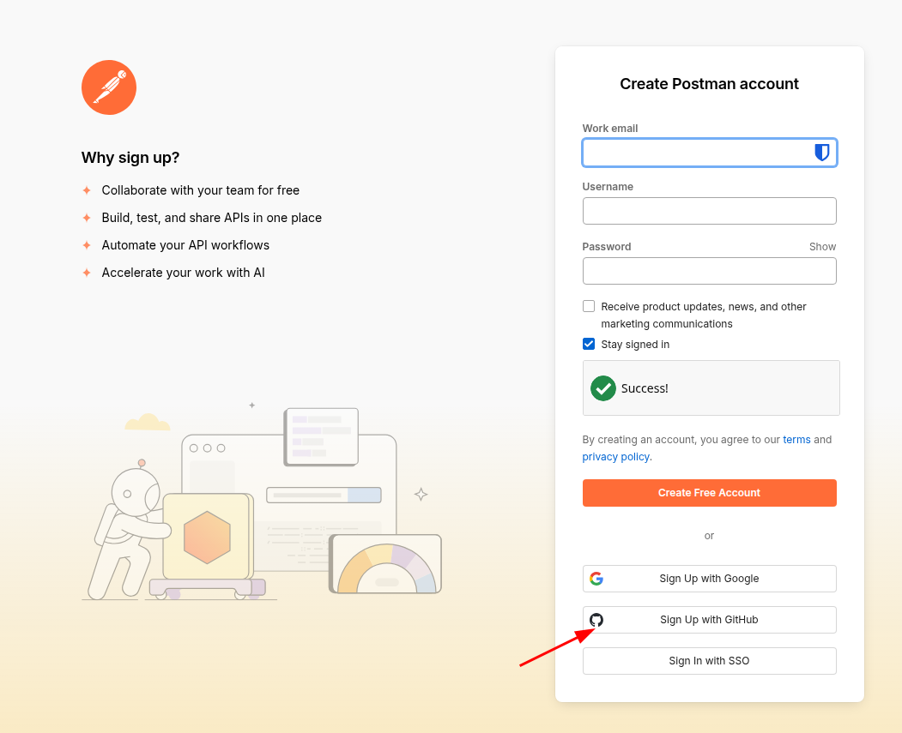
    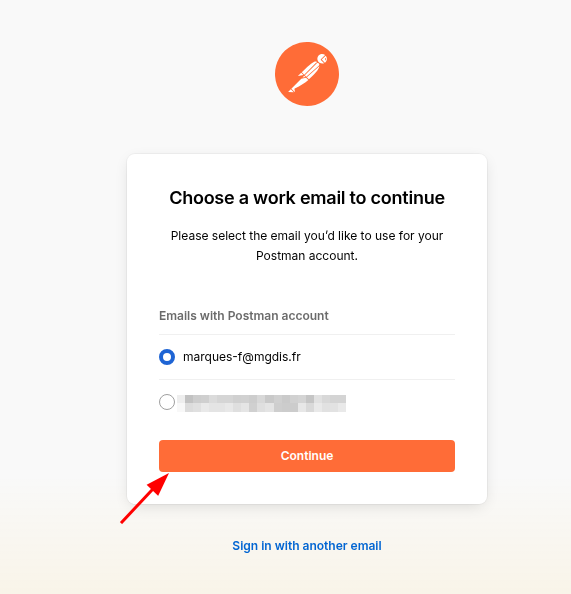
    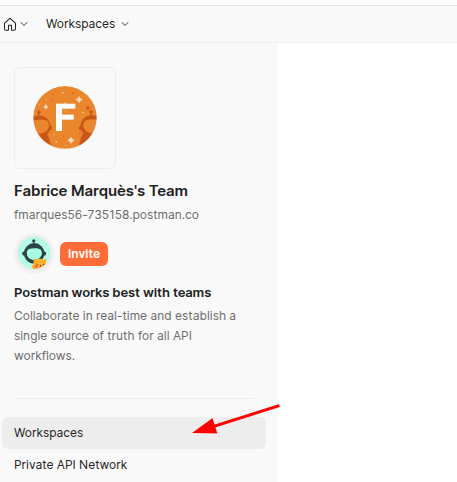

Espace de travail    
    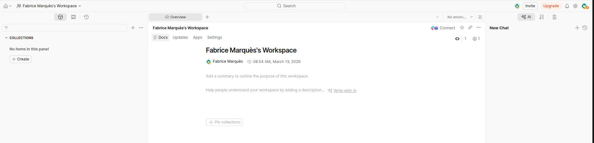

## Démarrage du TD

Lancer l'application :

[](https://github.com/codespaces/new?hide_repo_select=true&ref=master&repo=fmarques56/rhtest)


Créer codespace

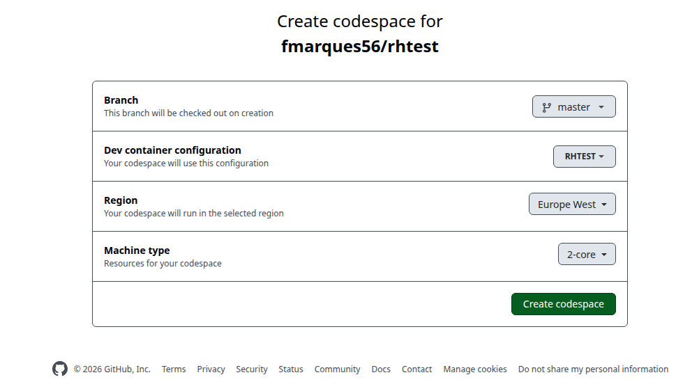


Attendre le chargement complet

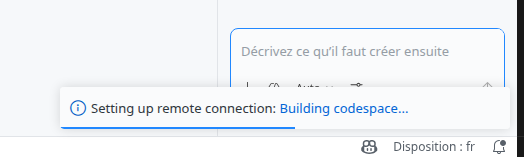


Ouvrir le port 8080 en public


Lancer l'application, sur le port 8086

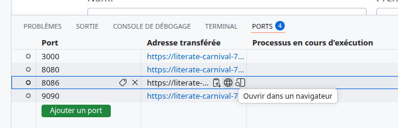

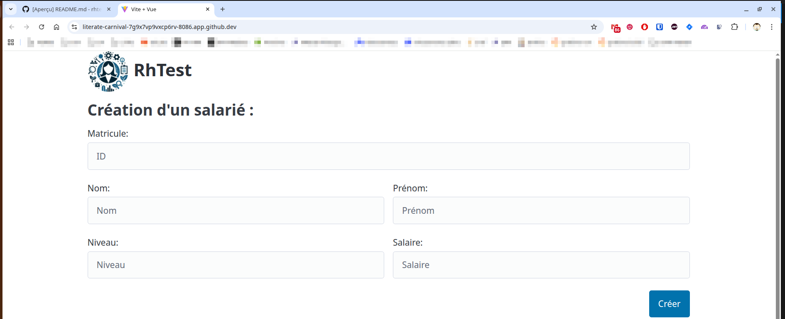


Récupérer l'url (endPoint)

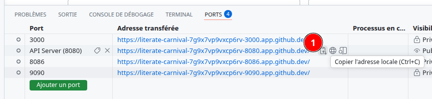

ici:

`https://literate-carnival-7g9x7vp9vxcp6rv-8080.app.github.dev/`


### Création du projet et des ressources à utiliser

Créer un nouveau projet vide

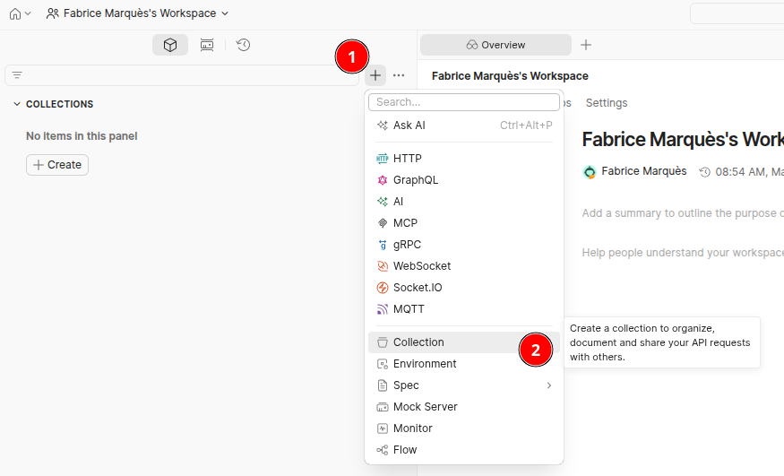

### Création d’une suite de test et d’un cas de test

Créer une premiere requête

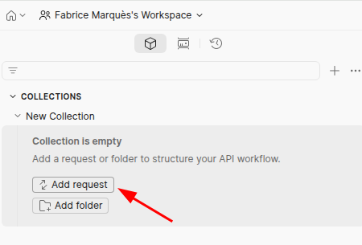

Compléter la requête

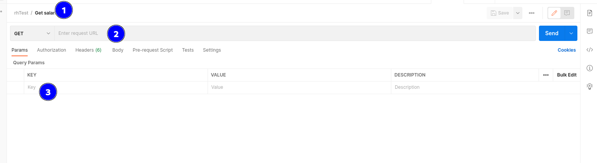

1- titre de la requête  
2- endPoint (exposition)  
3- les paramètres de requête.

Les APIs de l'application sont décrites sur le port 8080

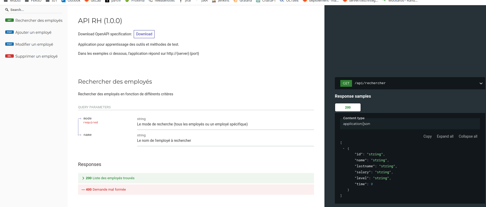

Exemple complet

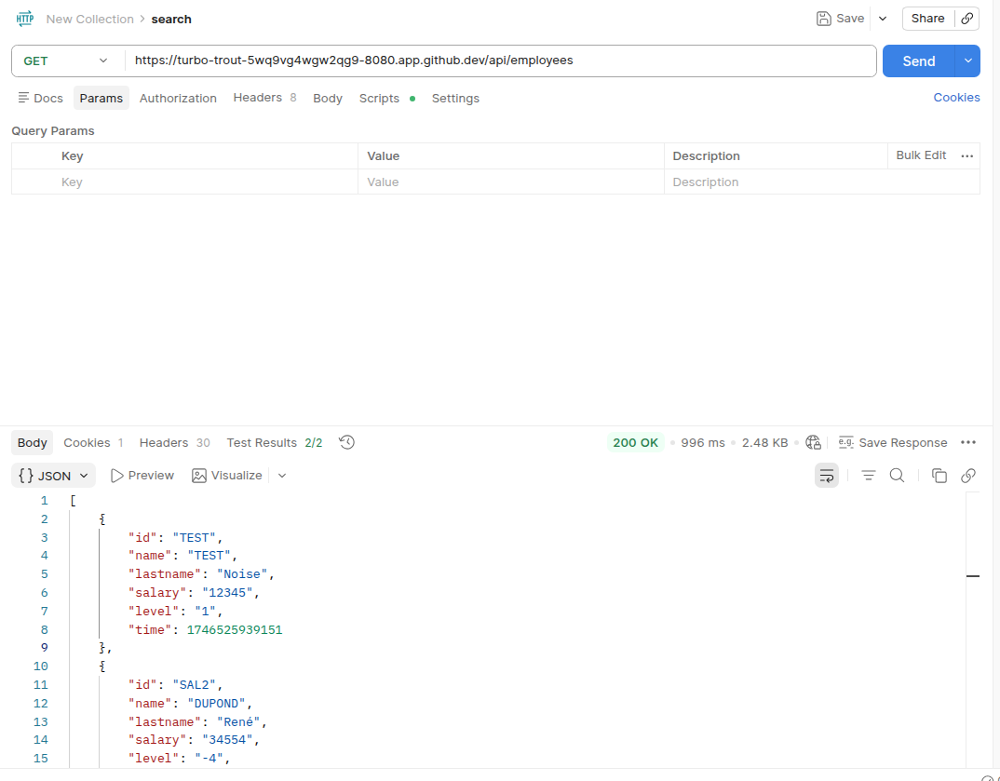

### Les varialbles

Exemples de variables, ici la base URL

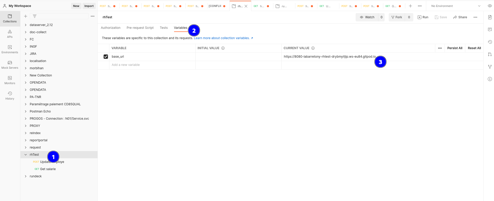

```
base_url : https://literate-carnival-7g9x7vp9vxcp6rv-8080.app.github.dev
```

utiliser la variable, en remplaçant le endPoint par `
{{base_url}}`
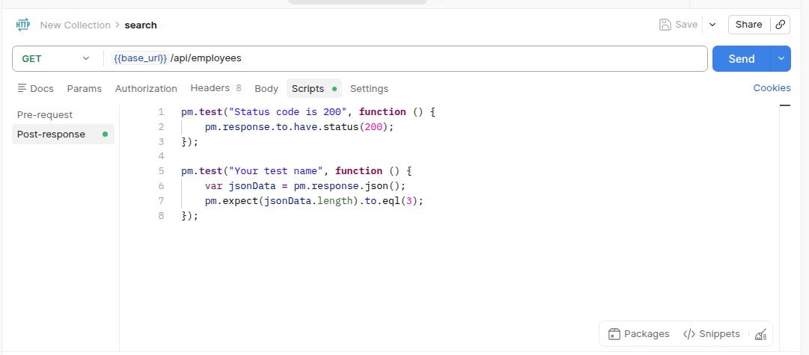

### Les assertions

Exemple d'assertion :

Assert Content et Assert Status

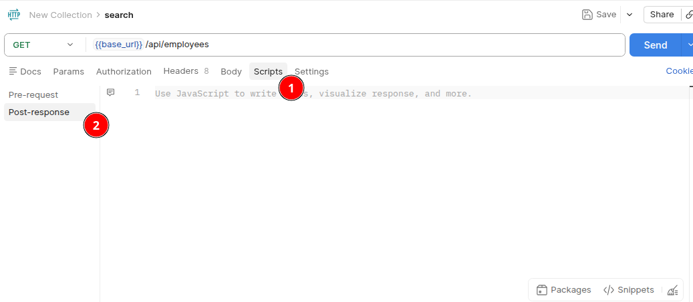

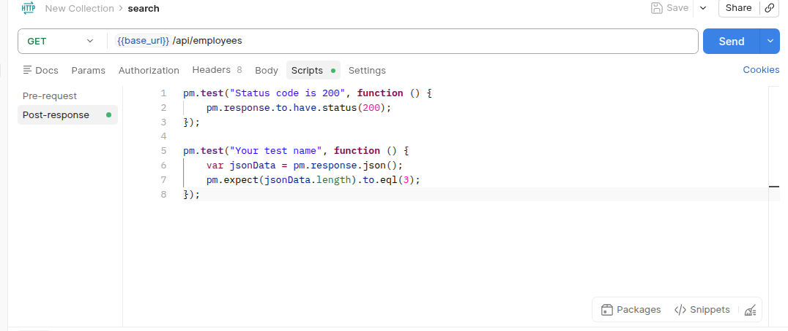

```javascript
pm.test("Status code is 200", function () {
    pm.response.to.have.status(200);
});

pm.test("Your test name", function () {
    var jsonData = pm.response.json();
    pm.expect(jsonData.length).to.eql(3);
});
```

Contrôle :

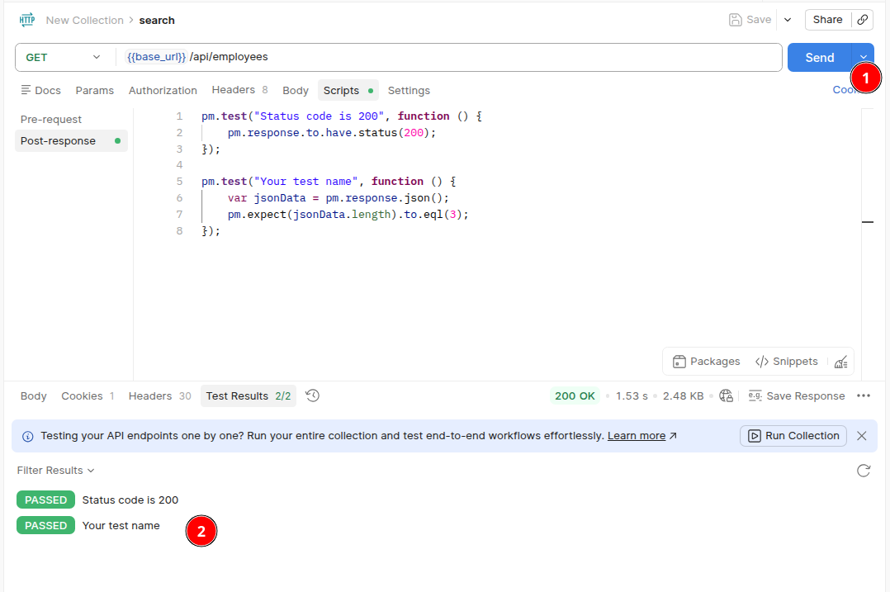

## Objectifs

Pour chaque point d'entré de l'application (EndPoint) réaliser une suite de test avec un point de contrôle (assertion) sur le status code et un sur la réponse obtenue.

Les suites de tests doivent être autonome, et rejouable plusieurs fois.

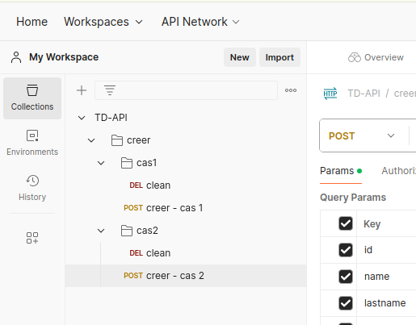


Pour extraire la collection

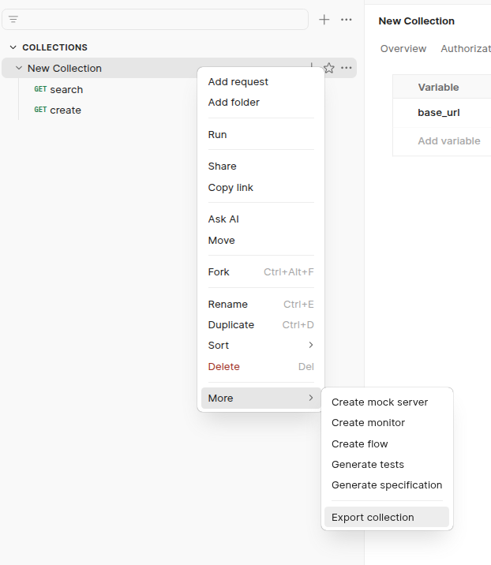

## Travail à réaliser

Token de l'application : `monTokenSecret123`

---

#### _ex 01 :_ Créer

Dans la suite de test **"Créer"**, il va falloir :

---

- _Cas de test 1 :_ Cas nominal (fonctionnel)

  Ajouter un employé et contrôler avec 2 assertions

  <details>
    <summary>Réponse</summary>

    **Méthode** : `POST`

    **URL** : `{{base_url}}/api/ajouter`

    **Body** :
    ```json
    {
      "id": "test001",
      "name": "martin",
      "lastname": "pierre",
      "salary": "15000",
      "level": "1",
      "time": 0
    }
    ```

    **Assertions** :
    ```javascript
    pm.test("Status code is 201", function () {
      pm.response.to.have.status(201);
    });

    pm.test("Body matches string", function () {
      pm.expect(pm.response.text()).to.include("L'employé a été ajouté avec succès");
    });
    ```
  </details>

---

- _Cas de test 2 :_ Cas invalide

  Ajouter un employé avec des critères invalides (ex: `level` hors bornes)

  <details>
    <summary>Réponse</summary>

    **Méthode** : `POST`

    **URL** : `{{base_url}}/api/ajouter`

    **Body** :
    ```json
    {
      "id": "test002",
      "name": "martin",
      "lastname": "pierre",
      "salary": "15000",
      "level": "-11",
      "time": 0
    }
    ```

    **Assertions** :
    ```javascript
    pm.test("Status code is 400", function () {
      pm.response.to.have.status(400);
    });

    pm.test("Body matches string", function () {
      pm.expect(pm.response.text()).to.include("Le niveau doit être > -10 et < 10");
    });
    ```
  </details>

---

- _Cas de test 3 :_ Cas invalide(champ obligatoire manquant)

  Ajouter un employé avec des champs obligatoires manquants

  <details>
    <summary>Réponse</summary>

    **Méthode** : `POST`

    **URL** : `{{base_url}}/api/ajouter`

    **Body** :
    ```json
    {
      "id": "",
      "name": "martin",
      "lastname": "pierre",
      "salary": "15000",
      "level": "1",
      "time": 0
    }
    ```

    **Assertions** :
    ```javascript
    pm.test("Status code is 400", function () {
      pm.response.to.have.status(400);
    });

    pm.test("Body matches string", function () {
      pm.expect(pm.response.text()).to.include("Le matricule est obligatoire");
    });
    ```
  </details>

---

- _Cas de test 4 :_ Cas invalide (duplication)

  Ajouter 2x le même employé

  <details>
    <summary>Réponse</summary>

    **1er ajout** :

    **Méthode** : `POST`

    **URL** : `{{base_url}}/api/ajouter`

    **Body** :
    ```json
    {
      "id": "test003",
      "name": "martin",
      "lastname": "pierre",
      "salary": "15000",
      "level": "1",
      "time": 0
    }
    ```

    **Assertions** :
    ```javascript
    pm.test("Status code is 201", function () {
      pm.response.to.have.status(201);
    });

    pm.test("Body matches string", function () {
      pm.expect(pm.response.text()).to.include("L'employé a été ajouté avec succès");
    });
    ```

    **2e ajout (même id)** :

    **Méthode** : `POST`

    **URL** : `{{base_url}}/api/ajouter`

    **Body** :
    ```json
    {
      "id": "test003",
      "name": "martin",
      "lastname": "pierre",
      "salary": "15000",
      "level": "1",
      "time": 0
    }
    ```

    **Assertions** :
    ```javascript
    pm.test("Status code is 409", function () {
      pm.response.to.have.status(409);
    });

    pm.test("Body matches string", function () {
      pm.expect(pm.response.text()).to.include("L'employé existe déjà");
    });
    ```
  </details>

---

### _ex 02 :_ Modifier

Dans la suite de test **"Modifier"**, il va falloir :

---

- _Cas de test 1 :_ Cas nominal

  Ajouter un employé puis modifier un critère (ex: salaire)

  <details>
    <summary>Réponse</summary>

    **Méthode** : `PUT`

    **URL** : `{{base_url}}/api/modifier/test001`

    **Body** :
    ```json
    {
      "name": "martin",
      "lastname": "pierre",
      "salary": "16000",
      "level": "1"
    }
    ```

    **Assertions** :
    ```javascript
    pm.test("Status code is 200", function () {
      pm.response.to.have.status(200);
    });

    pm.test("Body matches string", function () {
      pm.expect(pm.response.text()).to.include("L'employé a été modifié avec succès");
    });
    ```
  </details>

---

- _Cas de test 2 :_ Cas invalide

  Modifier un employé avec une donnée invalide (ex: salaire négatif)

  <details>
    <summary>Réponse</summary>

    **Méthode** : `PUT`

    **URL** : `{{base_url}}/api/modifier/test001`

    **Body** :
    ```json
    {
      "name": "martin",
      "lastname": "pierre",
      "salary": "-1000",
      "level": "1"
    }
    ```

    **Assertions** :
    ```javascript
    pm.test("Status code is 400", function () {
      pm.response.to.have.status(400);
    });

    pm.test("Body matches string", function () {
      pm.expect(pm.response.text()).to.include("L'employé n'a pas été modifié");
    });
    ```
  </details>

---

### _ex 03 :_ Rechercher

Dans la suite de test **"Rechercher"**, il va falloir :

---

- _Cas de test 1 :_ Cas nominal

  Ajouter un employé puis le rechercher

  <details>
    <summary>Réponse</summary>

    **Méthode** : `POST`

    **URL** : `{{base_url}}/api/rechercher`

    **Body** :
    ```json
    {
      "mode": "fulltext",
      "search": "martin"
    }
    ```

    **Assertions** :
    ```javascript
    pm.test("Status code is 200", function () {
      pm.response.to.have.status(200);
    });

    pm.test("Body contains employee", function () {
      var jsonData = pm.response.json();
      pm.expect(jsonData.some(e => e.name === "martin")).to.be.true;
    });
    ```
  </details>

---

- _Cas de test 2 :_ Cas invalide

  Recherche avec mode absent ou incorrect

  <details>
    <summary>Réponse</summary>

    **Méthode** : `POST`

    **URL** : `{{base_url}}/api/rechercher`

    **Body** :
    ```json
    {
      "search": "martin"
    }
    ```

    **Assertions** :
    ```javascript
    pm.test("Status code is 400", function () {
      pm.response.to.have.status(400);
    });

    pm.test("Body matches string", function () {
      pm.expect(pm.response.text()).to.include("mode");
    });
    ```
  </details>

---

### _ex 04 :_ Supprimer

Dans la suite de test **"Supprimer"**, il va falloir :

---

- _Cas de test 1 :_ Cas nominal

  Ajouter un employé puis le supprimer

  <details>
    <summary>Réponse</summary>

    **Méthode** : `DELETE`

    **URL** : `{{base_url}}/api/supprimer?id=test001`

    **Assertions** :
    ```javascript
    pm.test("Status code is 200", function () {
      pm.response.to.have.status(200);
    });

    pm.test("Body matches string", function () {
      pm.expect(pm.response.text()).to.include("L'employé a été supprimé avec succès");
    });
    ```
  </details>

---

- _Cas de test 2 :_ Cas invalide

  Supprimer un employé inexistant

  <details>
    <summary>Réponse</summary>

    **Méthode** : `DELETE`

    **URL** : `{{base_url}}/api/supprimer?id=notfound`

    **Assertions** :
    ```javascript
    pm.test("Status code is 400", function () {
      pm.response.to.have.status(400);
    });

    pm.test("Body matches string", function () {
      pm.expect(pm.response.text()).to.include("erreur");
    });
    ```
  </details>

---

### _ex 05 :_ Endpoints Admin

---

- _Cas de test 1 :_ Supprimer toutes les données

  <details>
    <summary>Réponse</summary>

    **Méthode** : `DELETE`

    **URL** : `{{base_url}}/api/deleteall`

    **Header** : `authorization: <token>`

    **Assertions** :
    ```javascript
    pm.test("Status code is 200", function () {
      pm.response.to.have.status(200);
    });

    pm.test("Body matches string", function () {
      pm.expect(pm.response.text()).to.include("OK");
    });
    ```
  </details>

---

- _Cas de test 2 :_ Restaurer les données de test

  <details>
    <summary>Réponse</summary>

    **Méthode** : `POST`

    **URL** : `{{base_url}}/api/datatest`

    **Header** : `authorization: <token>`

    **Assertions** :
    ```javascript
    pm.test("Status code is 201", function () {
      pm.response.to.have.status(201);
    });

    pm.test("Body matches string", function () {
      pm.expect(pm.response.text()).to.include("OK");
    });
    ```
  </details>

---

- _Cas de test 3 :_ Tester les erreurs d'authentification (token manquant ou invalide)

  <details>
    <summary>Réponse</summary>

    **Méthode** : `DELETE`

    **URL** : `{{base_url}}/api/deleteall`

    **Header** : `authorization:`

    **Assertions** :
    ```javascript
    pm.test("Status code is 401", function () {
      pm.response.to.have.status(401);
    });
    ```
  </details>

---

### _ex 06 :_ Exercices complémentaires

---

- Tester la récupération d'un employé par son id (`/api/employee/{id}`)

  <details>
    <summary>Réponse</summary>

    **Méthode** : `GET`

    **URL** : `{{base_url}}/api/employee/test001`

    **Assertions** :
    ```javascript
    pm.test("Status code is 200", function () {
      pm.response.to.have.status(200);
    });

    pm.test("Body contains employee", function () {
      var jsonData = pm.response.json();
      pm.expect(jsonData.id).to.eql("test001");
    });
    ```
  </details>

  **Cas erreur** : Employé inexistant (status 404)

---

- Tester la recherche détaillée avec plusieurs critères (ex: name + level)

  <details>
    <summary>Réponse</summary>

    **Méthode** : `POST`

    **URL** : `{{base_url}}/api/rechercher`

    **Body** :
    ```json
    {
      "mode": "detailed",
      "search": { "name": "martin", "level": "1" }
    }
    ```

    **Assertions** :
    ```javascript
    pm.test("Status code is 200", function () {
      pm.response.to.have.status(200);
    });

    pm.test("Body contains employee", function () {
      var jsonData = pm.response.json();
      pm.expect(jsonData.some(e => e.name === "martin" && e.level === "1")).to.be.true;
    });
    ```
  </details>

---

- Tester la modification d'un employé inexistant (status 404)

  <details>
    <summary>Réponse</summary>

    **Méthode** : `PUT`

    **URL** : `{{base_url}}/api/modifier/notfound`

    **Body** :
    ```json
    {
      "name": "martin",
      "lastname": "pierre",
      "salary": "16000",
      "level": "1"
    }
    ```

    **Assertions** :
    ```javascript
    pm.test("Status code is 404", function () {
      pm.response.to.have.status(404);
    });
    ```
  </details>

---

- Tester la suppression sans paramètre id (status 400)

  <details>
    <summary>Réponse</summary>

    **Méthode** : `DELETE`

    **URL** : `{{base_url}}/api/supprimer`

    **Assertions** :
    ```javascript
    pm.test("Status code is 400", function () {
      pm.response.to.have.status(400);
    });
    ```
  </details>

---

- Tester la création d'un employé avec un champ time incorrect (ex: string au lieu de number)

  <details>
    <summary>Réponse</summary>

    **Méthode** : `POST`

    **URL** : `{{base_url}}/api/ajouter`

    **Body** :
    ```json
    {
      "id": "test004",
      "name": "martin",
      "lastname": "pierre",
      "salary": "15000",
      "level": "1",
      "time": "notanumber"
    }
    ```

    **Assertions** :
    ```javascript
    pm.test("Status code is 400", function () {
      pm.response.to.have.status(400);
    });
    ```
  </details>
