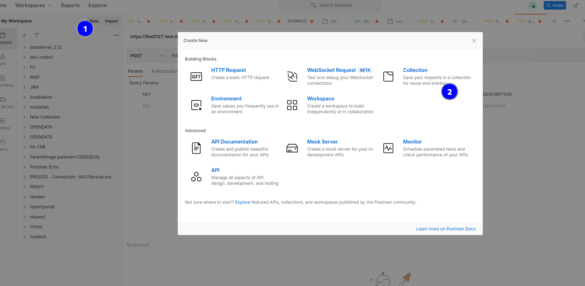
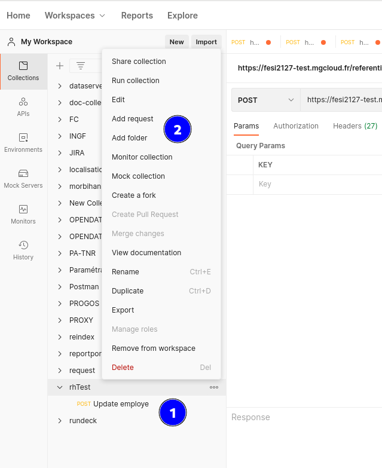
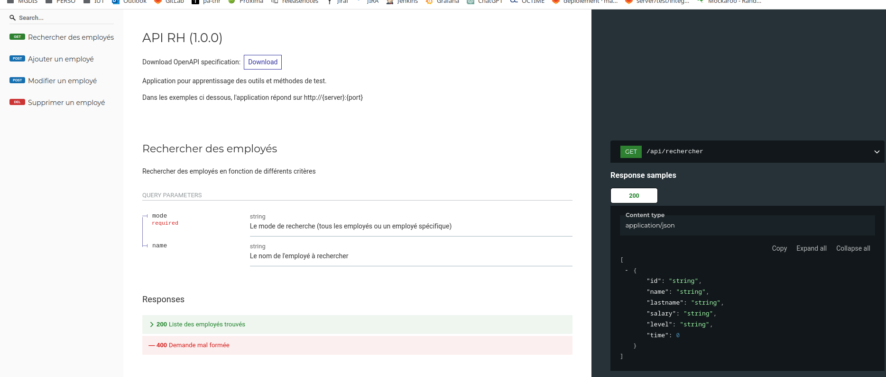
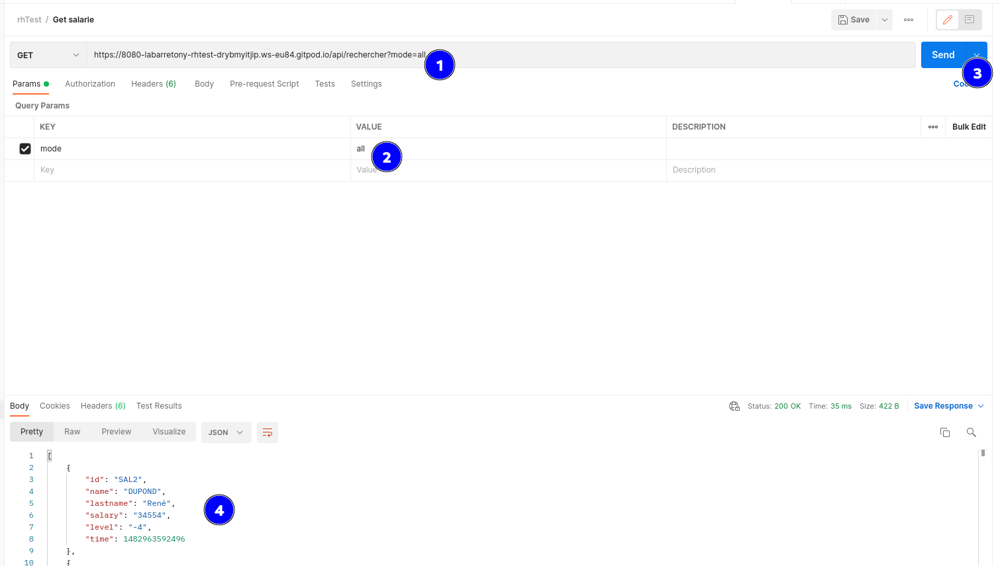
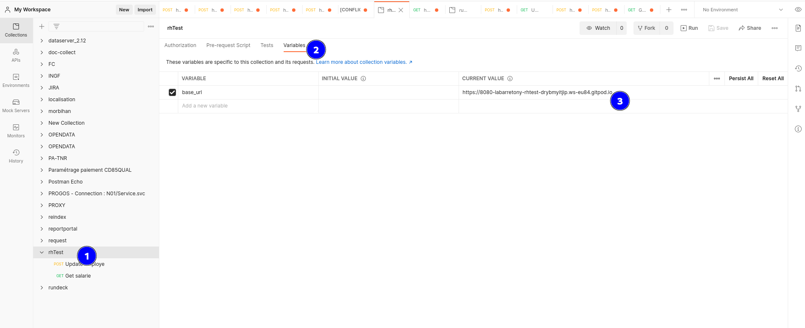
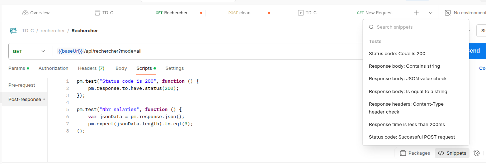
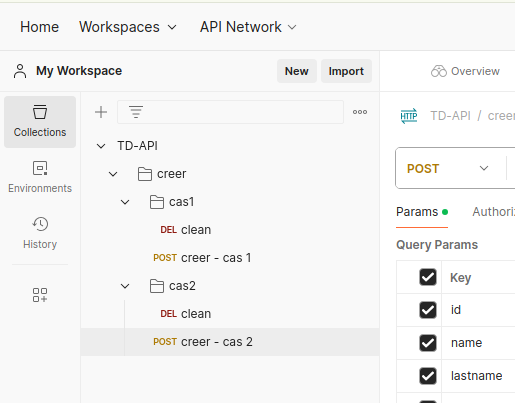

# TP: Tests des APi

L’objectif du TP est de découvrir le test des Api Rest.

Une API permet d’exposer à des clients des méthodes et des objets de manière simple, mais le client
d’une API doit être assuré de la stabilité des signatures et du comportement pour une version
mineure donnée.

Il est donc intéressant de vérifier qu’une API reste stable et respecte son contrat d’interface dans le
temps. Pour cela il faut créer des tests fonctionnels et automatiser leur lancement pour qu’ils soient
exécutés lors de l’intégration continue.

Postman, en se basant sur les contrats, permet de créer rapidement de nouveaux cas
de tests, avant même que le travail de développement soit commencé (Contract First, Test Driven
Development).

Les assertions, points de contrôle, qui vérifient qu'un contrat est respecté s'attacheront à comparer
les codes de retours des appels, en commençant principalement par les cas nominaux (le cas
standard représentant 80% des appels effectués).

La variabilisation des données (Data Driven Testing) ainsi que le changement d'endpoint (cible)
permettent de rejouer facilement une suite de tests sur plusieurs environnements.

## Pré requis

1.  Démarrer l'application RhTest (via GitPod)
2.  Disposer du référentiel d'exigences
3.  Utiliser la version en ligne de de Postman Open Source disponible [ici](https://www.postman.com/)
    

## Démarrage du TD

### Création du projet et des ressources à utiliser

Créer un nouveau projet vide

### Création d’une suite de test et d’un cas de test

Créer une premiere requête

Compléter la requête

1- titre de la requête  
2- endPoint (exposition)  
3- les paramètres de requête.

Les APIs de l'application sont décrites sur le port 8080

Exemple complet

### Les varialbles

Exemples de variables, ici la base URL

### Les assertions

Exemple d'assertion :

Assert Content

Assert Status

## Objectifs

Pour chaque point d'entré de l'application (EndPoint) réaliser une suite de test avec un point de contrôle (assertion) sur le status code et un sur la réponse obtenue.

Les suites de tests doivent être autonome, et rejouable plusieurs fois.

## Travail à réaliser

_ex 01 :_ Créer  
Dans la suite de test "Créer", il va falloir

- _Cas de test 1 :_ Cas nominal (fonctionnel)  
  Ajouter un employé  
  Et contrôler avec 2 assertions
  

  
Réponse

  METHOD : POST

  URL : {{baseURL}}/api/ajouter?id=test001&name=martin&lastname=pierre&salary=15000&level=1

  TEST :  
  <code>
  pm.test("Status code is 201", function () {  
   pm.response.to.have.status(201);  
  });

  pm.test("Body matches string", function () {
  pm.expect(pm.response.text()).to.include("Le salarié a bien été ajouté");  
  });
  </code>

  

- _Cas de test 2 :_ Cas en erreur  
  Ajouter un employé avec des critères invalides  
  Et contrôler avec 2 assertions
- _Cas de test 3 :_ Cas en erreur  
  Ajouter un employé avec des critères obligatoires non renseignés  
  Et contrôler avec 2 assertions
- _Cas de test 4 :_ Cas en erreur (duplication)  
  Ajouter 2x le même employé  
  Et contrôler avec 2 assertions

_ex 02 :_ Modifier  
Dans la suite de test "Modifier", il va falloir

- _Cas de test 1 :_ Cas nominal (fonctionnel)  
  Ajouter un employé puis modifier un critère (le salauire)  
  Et contrôler avec 2 assertions
- _Cas de test 2 :_ Cas en erreur  
  Ajouter un employé avec des critères valides puis modifier un critère avec une donnée en erreur (salaire néfgatif)  
  Et contrôler avec 2 assertions
- _Cas de test 3 :_ Cas en erreur (duplication)  
  Ajouter deux employés puis modifer le second pour correspondre au premier  
  Et contrôler avec 2 assertions

_ex 03 :_ Rechercher  
Dans la suite de test "Rechercher", il va falloir

- _Cas de test 1 :_ Cas nominal (fonctionnel)  
  Ajouter un employé puis le rechercher  
  Et contrôler avec 2 assertions
- _Cas de test 2 :_ Cas en erreur (vide)  
  Ajouter un employé avec des critères valides puis rechercher sur d'autres critères
  Et contrôler avec 2 assertions

_ex 04 :_ Supprimer  
Dans la suite de test "Supprimer", il va falloir

- _Cas de test 1 :_ Cas nominal (fonctionnel)  
  Ajouter un employé puis le supprimer  
  Et contrôler avec 2 assertions
- _Cas de test 2 :_ Cas en erreur (vide)  
  Supprimer un employé inexistant
  Et contrôler avec 2 assertions
