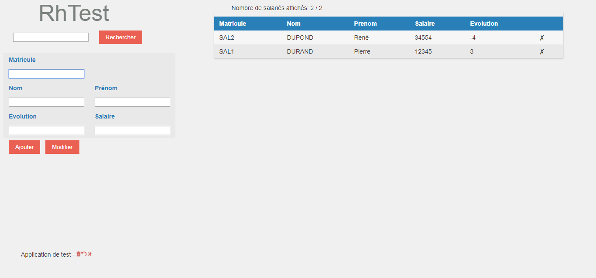
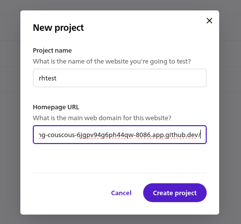
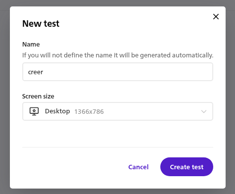
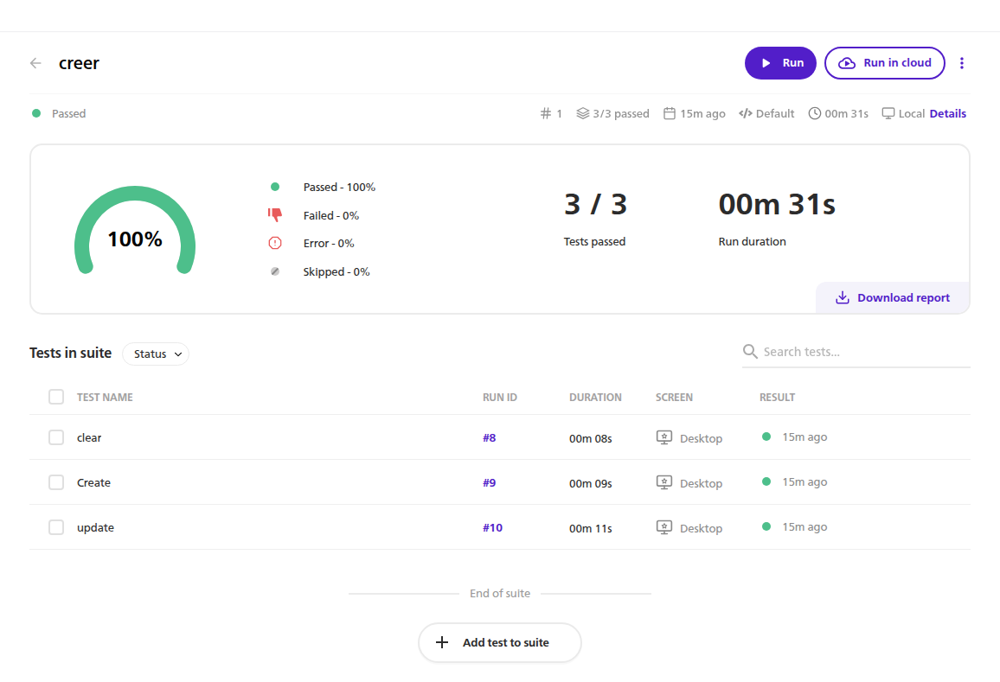
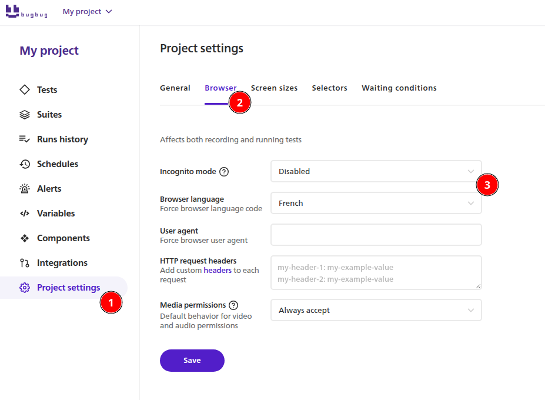
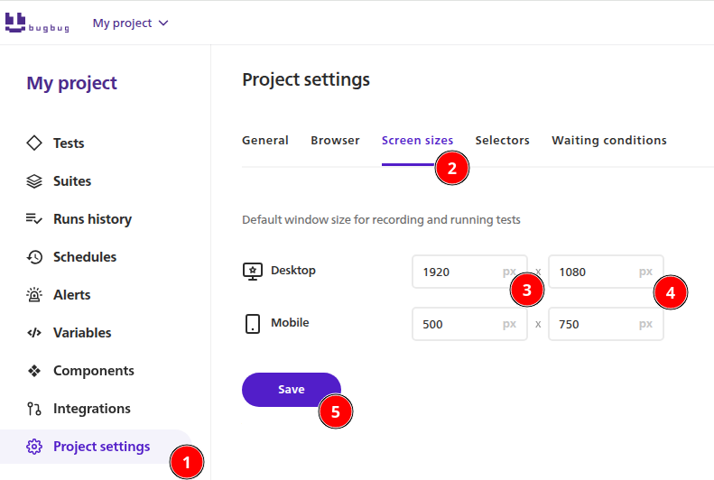
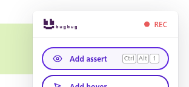
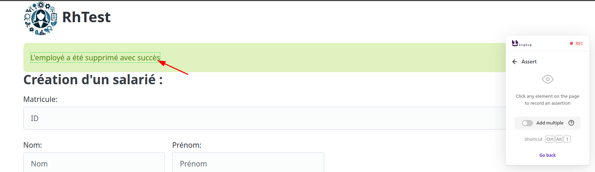

# TP - Construire son premier test fonctionnel automatisé

Dans ce TP, on cherche à vérifier que l'application graphique respecte les besoins du clients. On va donc enregistrer des scénarios utilisateur qui permettront de détecter les erreurs mais aussi de valider les fonctionnalités corrects (elles doivent le rester).

Pour corriger les bugs, les développeurs seront ensuite amené à retravailler sur l'application. Pour les testeurs, l'automate permettra de rapidement revalider l'application sans intervention humaine.

Aujourd'hui, nous utiliserons l'outil Selenium Ide qui permet de réaliser d'enregistrer des séquences d'actions (clic, saisie clavier), d'y ajouter des points de contrôles (présence d'un message d'erreur, ajout d'un utilisateur dans un tableau) et de les rejouer à volonté afin d'assurer la non regression de l'application sous test.

## Pré requis

1.  Démarrer l'application RhTest
2.  Disposer du référentiel d'exigences
3.  Installer le plugin BugBug Automation Testin depuis la page [BugBug Automation Testing](https://chromewebstore.google.com/detail/bugbug-automation-testing/oiedehaafceacbnnmindilfblafincjb)
4.  Créer un compte https://bugbug.io

Une fois installé, l'outil est disponible dans les barres d'outils de Chrome ou Firefox sur l'icone

Lancer l'application :

Rendre public les ports 8080 et 8086

## Découvrir bugbug

Projet

Cas de test

Les cas de tests seront ensuite orchestrés dans des suites de test

### Modifier les paramétres du projet

### Ajouter des assertions

## Travail à réaliser

_ex 01 :_ Créer  
Dans la suite de test "Créer", il va falloir

- _Cas de test 1 :_ Cas nominal (fonctionnel)  
  Ajouter un employé  
  Et contrôler avec au moins 1 assertion
- _Cas de test 2 :_ Cas en erreur  
  Ajouter un employé avec des critères invalides  
  Et contrôler avec au moins 1 assertion
- _Cas de test 3 :_ Cas en erreur  
  Ajouter un employé avec des critères obligatoires non renseignés
  Et contrôler avec au moins 1 assertion
- _Cas de test 4 :_ Cas en erreur (duplication)  
  Ajouter 2x le même employé  
  Et contrôler avec au moins 1 assertion

_ex 02 :_ Modifier  
Dans la suite de test "Modifier", il va falloir

- _Cas de test 1 :_ Cas nominal (fonctionnel)  
  Ajouter un employé puis modifier un critère (le salaire)  
  Et contrôler avec au moins 1 assertion
- _Cas de test 2 :_ Cas en erreur  
  Ajouter un employé avec des critères valides puis modifier un critère avec une donnée en erreur (salaire néfgatif)  
  Et contrôler avec au moins 1 assertion

_ex 03 :_ Rechercher  
Dans la suite de test "Rechercher", il va falloir

- _Cas de test 1 :_ Cas nominal (fonctionnel)  
  Ajouter un employé puis le rechercher  
  Et contrôler avec au moins 1 assertion
- _Cas de test 2 :_ Cas en erreur (vide)  
  Ajouter un employé avec des critères valides puis rechercher sur d'autres critères
  Et contrôler avec au moins 1 assertion

_ex 04 :_ Recherche détaillée    
Dans la suite de test "Recherche détaillée", il va falloir

- _Cas de test 1 :_ Cas nominal (fonctionnel)  
  Ajouter un employé puis le rechercher en mode détaillé
  Et contrôler avec au moins 1 assertion
- _Cas de test 2 :_ Cas en erreur (vide)  
  Ajouter un employé avec des critères valides puis rechercher en mode détaillé sur d'autres critères
  Et contrôler avec au moins 1 assertion

_ex 05 :_ Supprimer  
Dans la suite de test "Supprimer", il va falloir

- _Cas de test 1 :_ Cas nominal (fonctionnel)  
  Ajouter un employé puis le supprimer  
  Et contrôler avec au moins 1 assertion
- _Cas de test 2 :_ Cas en erreur (vide)  
  Supprimer un employé inexistant
  Et contrôler avec au moins 1 assertion

_ex 06 :_ Administration  
Dans la suite de test "Administration", il va falloir

- _Cas de test 1 :_ Cas nominal (fonctionnel)  
  Supprimer les données  
  Et contrôler avec au moins 1 assertion
- _Cas de test 2 :_ Cas nominal (fonctionnel)  
  Restaurer les données
  Et contrôler avec au moins 1 assertion
- _Cas de test 3 :_ Cas en erreur (vide)  
  Supprimer les données sans token
  Et contrôler avec au moins 1 assertion
- _Cas de test 4 :_ Cas en erreur (faux)  
  Supprimer les données avec mauvais token
  Et contrôler avec au moins 1 assertion

Une fois que l'ensemble des exigences sont enregistrées, rejouer la séquence complète.
